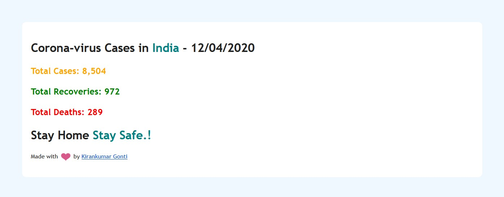

# **Corona Tracking App With Python**

## **Project Setup**
 * Clone the project or download
 * Turn On **less secure apps** option for the gmail account that you're using for this project to send mail.
 https://myaccount.google.com/lesssecureapps

 * You should turn off the **2-Step- Verification** for the google account
 https://myaccount.google.com/signinoptions/two-step-verification/enroll-welcome

**Project Snapshot:**

